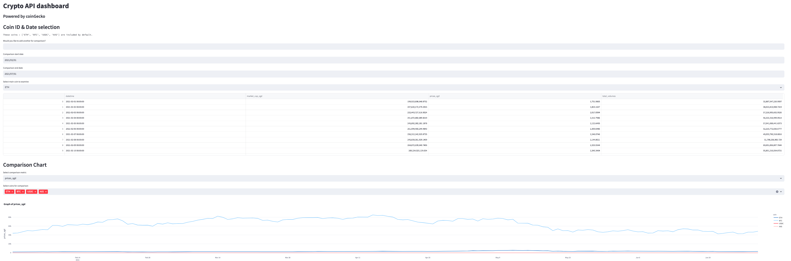
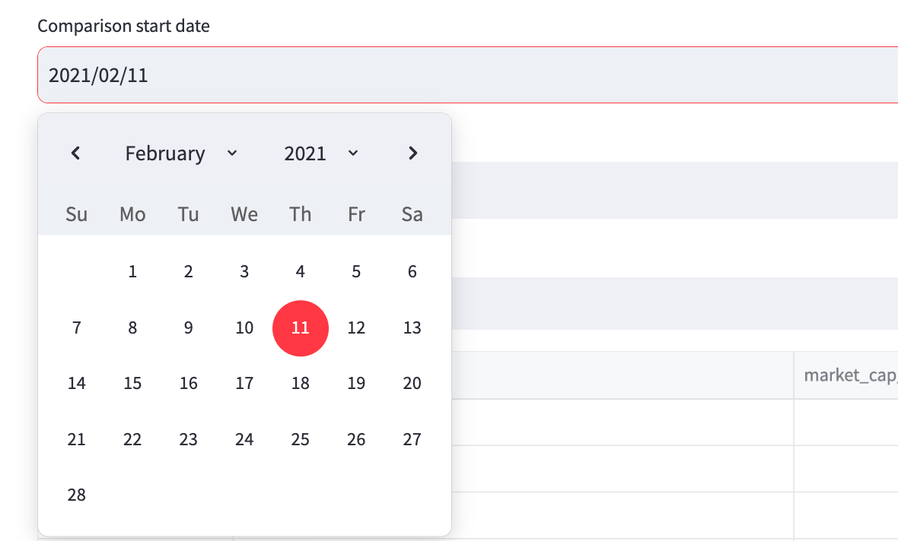
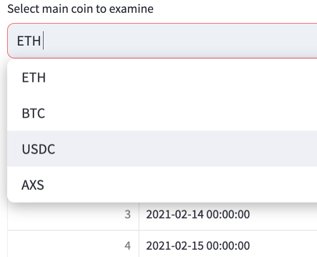
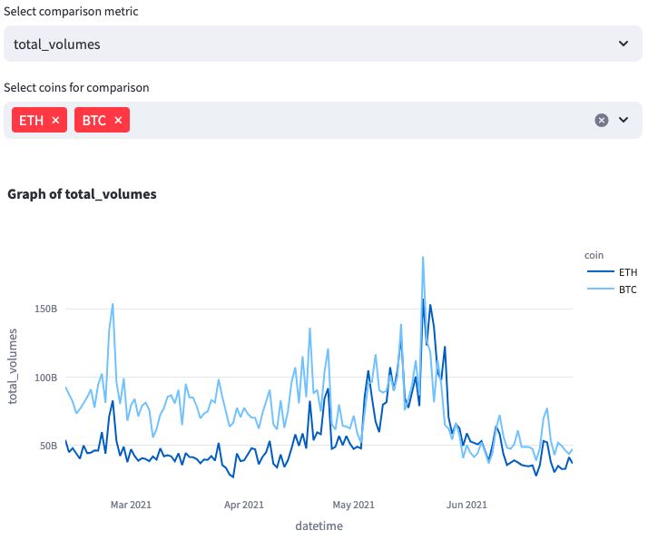
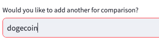

# Introduction
This project is a simple exploration of the `coinGecko` API. 

In this project a user can view historical data of any coin listed on the `coinGecko` API, as well as make comparisons with any of the 4 coins included by default. 

# Getting started
Get started with these steps : 

1. Clone this repo locally to your own machine
2. Install all dependencies with `pip install -r requirements.txt`
3. Enter the `main` directory with `cd main`
4. Intialize the streamlit app with `streamlit run dashboard.py`

You should now be able to interact with the dashboard

# Dashboard Interactivity
The landing page of the dashboard : 

Select any date interval range with the start / end date selectors :

Select the coin for which you wish to view the granular dataframe information : 

Adjust the metric which you wish to compare against coins, as well as which coins to include in the comparison : 

If you wish to examine a coin not included by default, enter the coin's `coinGecko` coin_id into the input field to retrieve its data. It will then be available for use in all other parts of the dashboard

# Directory Structure
Quick summary on how this project is structured.

## main
This is the main folder of this project. 

The streamlit dashboard sits in this folder, as well as helper python files that manage different components of the dashboard. 

The python file for unit tests also sits in this folder. 

## test
This is a folder for testing out the functionality of the dashboard & its related helper files.

## resources
Administrative folder containing the images used in this markdown file.

## requirements.txt
Python dependencies needed to run this project. 

